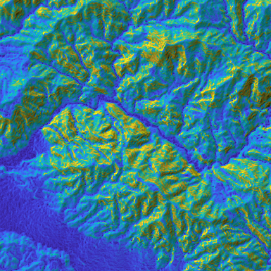
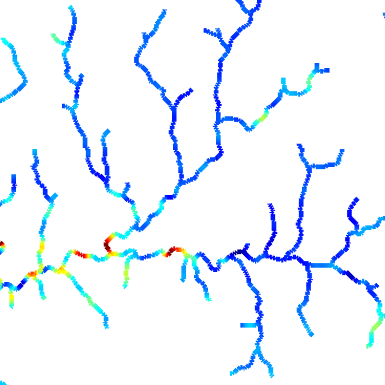
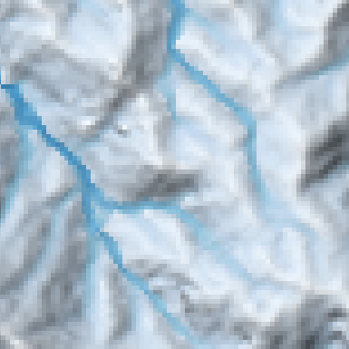

# TopoToolbox v3 - a set of MATLAB functions for topographic analysis

[TopoToolbox](http://topotoolbox.wordpress.com) is a MATLAB-based software designed for the analysis and visualization of topographic data. It provides a comprehensive set of tools for processing Digital Elevation Models (DEMs), extracting drainage networks, analyzing river profiles, and performing geomorphometric calculations. In addition, TopoToolbox facilitates hydrological modeling and landscape evolution studies. Its efficient algorithms and interactive visualization capabilities allow for detailed analysis of terrain features, helping to understand landscape processes and topographic changes over time.

Primary uses of TopoToolbox are in the field of geomorphology, hydrology, structural geology and tectonics, but there are many other applications ranging from meteorology to glaciology.

If you have any questions or remarks, please contact the authors:

* [Wolfgang Schwanghart](https://github.com/wschwanghart)

* [Dirk Scherler](https://sites.google.com/site/scherlerdirk/home)

* [Will Kearney](https://github.com/wkearn) 

## Requirements

TopoToolbox v3 is plat-form independent and requires **MATLAB R2023b or higher** and the **Image Processing Toolbox**. The **Mapping Toolbox** is not mandatory, but good to have to facilitate easy data exchange with GIS software. Some functions support parallelisation using the Parallel Toolbox. Few functions require the Optimization or Statistics and Machine Learning Toolbox.

If you are using an older version of MATLAB (< R2023b), use [TopoToolbox 2](https://github.com/topoToolbox/topotoolbox).

## Installation

### Download release and install

The easiest way to get started with TopoToolbox 3 is to download the `topotoolbox.mltbx` file from the [GitHub repository releases area](https://github.com/TopoToolbox/topotoolbox3/releases). Double-click on the downloaded file to run the MATLAB add-on installer. This will copy the files to your MATLAB add-ons area and add `TopoToolbox` to your MATLAB search path.

Later, you can use the [MATLAB Add-On Manager](https://www.mathworks.com/help/matlab/matlab_env/get-add-ons.html) to uninstall.

As a developer, we recommend to fork and clone the [TopoToolbox3 GitHub repository](https://github.com/TopoToolbox/topotoolbox3). Start by navigating to the [original repository on GitHub](https://github.com/TopoToolbox/topotoolbox3) and clicking the Fork button in the top right. This creates a copy of the repository in your own GitHub account. Next, clone the forked repository to your computer. Please read [the contributor guidelines](http://blank) more about how to contribute code to TopoToolbox.

### Download code

Alternatively, you can download the repository and save it to some folder on your harddrive. Before working with TopoToolbox the directories and functions must be on the search path of MATLAB. To do this, navigate your working directory to the `topotoolbox3/toolbox` folder and run the command:

		tt2path

To make these paths permanent, use the command (this may require system administrator privileges).

		savepath

The documentation will not be included in the code. To build the documentation, go to the folder `docs` and run the command

		publishtthelp2html

This will build html-files that can be viewed in MATLABs documentation. You'll find the TopoToolbox documentation in the section Supplemental Software, once you restart MATLAB. The documentation contains several user's guides that will help you getting started. In addition, TopoToolbox functions have extensive help sections (e.g. `help gradient8` or `help STREAMobj/modify`. An additional resource for code and examples is the [TopoToolbox blog](http://topotoolbox.wordpress.com).

Finally, TopoToolbox comes with bindings to libtopotoolbox, a C-library for terrain analysis. Currently, all TopoToolbox functions will work also without libtopotoolbox. To compile libtopotoolbox, navigate to the `topotoolbox3`-folder and run the command

		buildtool compile

To check whether compilation ran successfully, the following command

		haslibtopotoolbox

should return `true`.

## Getting started

Once you have TopoToolbox installed, you should get started with reading a DEM into a GRIDobj, the numerical class containing single-band raster datasets. TopoToolbox comes with an example file which you can read using the following command.

		DEM = GRIDobj('srtm_bigtujunga30m_utm11.tif');

Now plot this data using `imageschs`.

		imageschs(DEM)

Well done. If this works, your TopoToolbox installation should run. Now, check out the following introductory texts:

|Getting started |Calculate ksn |Multiple flow directions|
|----------------------------------|----------------------------------|-------------------------------------|
|  |  |  |

To see a list of all object methods (there are more functions available), see [this page](/./md/function_overview.md).

## References

When you use TopoToolbox in your work, please reference following 
publication:

- Schwanghart, W., Scherler, D. (2014): TopoToolbox 2 – MATLAB-based 
software for topographic analysis and modeling in Earth surface sciences. 
Earth Surface Dynamics, 2, 1-7. DOI: [10.5194/esurf-2-1-2014](http://dx.doi.org/10.5194/esurf-2-1-2014)

If you are using version 1, then please refer to this publication:

- Schwanghart, W., Kuhn, N.J. (2010): TopoToolbox: a set of MATLAB 
functions for topographic analysis. Environmental Modelling & Software, 
25, 770-781. DOI: [10.1016/j.envsoft.2009.12.002](http://dx.doi.org/10.1016/j.envsoft.2009.12.002)

In addition, various models and algorithms implemented in TopoToolbox have been published in the following articles. 

### DEM preprocessing and carving

- Schwanghart, W., Groom, G.B., Kuhn, N.J., Heckrath, G., 2013: Flow network derivation from a high 
resolution DEM in a low relief, agrarian landscape. Earth Surface Processes and Landforms, 38, 
1576-1586. DOI: [10.1002/esp.3452](http://dx.doi.org/10.1002/esp.3452)

- Schwanghart, W., Scherler, D., 2017. Bumps in river profiles: uncertainty assessment and smoothing 
using quantile regression techniques. Earth Surface Dynamics, 5, 821-839. DOI: [10.5194/esurf-5-821-2017](https://doi.org/10.5194/esurf-5-821-2017)

### TopoToolbox Landscape Evolution Modelling (TTLEM) and HyLands

- Campforts, B., Schwanghart, W., Govers, G. (2017): Accurate simulation of transient 
landscape evolution by eliminating numerical diffusion: the TTLEM 1.0 model. 
Earth Surface Dynamics, 5, 47-66. DOI: [10.5194/esurf-5-47-2017](http://dx.doi.org/10.5194/esurf-5-47-2017)

- HyLands: Campforts B., Shobe M.C., et al. (2020): HyLands 1.0: a Hybrid Landscape 
evolution model to simulate the impact of landslides and landslide-derived sediment on landscape evolution. 
Geosci. Model Dev., 13, 3863–3886. DOI: [10.5194/gmd-13-3863-2020](http://dx.doi.org/10.5194/gmd-13-3863-2020)

### Excess topography

- Blöthe, J.H., Korup, O., Schwanghart, W., 2015: Large landslides lie low: Excess topography in the Himalaya-Karakorum ranges. 
  Geology, 43, 523-526. [DOI: 10.1130/G36527.1](https://doi.org/10.1130/G36527.1)

### Knickpointfinder

- Stolle, A., Schwanghart, W., Andermann, C., Bernhardt, A., Fort, M., Jansen, J.D., Wittmann, H., Merchel, S., 
  Rugel, G., Adhikari, B.R., Korup, O., 2019. Protracted river response to medieval earthquakes. Earth Surface Processes 
  and Landforms, 44, 331-341. DOI: [10.1002/esp.4517](https://doi.org/10.1002/esp.4517) (The description here is very terse, yet)

### Divide functions

- Scherler, D., Schwanghart, W., 2020. Drainage divide networks – Part 1: Identification and ordering in digital elevation models. 
Earth Surface Dynamics, 8, 245–259. [DOI: 10.5194/esurf-8-245-2020](http://dx.doi.org/10.5194/esurf-8-245-2020)

- Scherler, D., Schwanghart, W., 2020. Drainage divide networks – Part 2: Response to perturbations. 
Earth Surface Dynamics, 8, 261-274. [DOI: 10.5194/esurf-8-261-2020](http://dx.doi.org/10.5194/esurf-8-261-2020)

### Point patterns on stream networks

- Schwanghart, W., Molkenthin, C., & Scherler, D. (2020). A systematic approach and software for the analysis 
of point patterns on river networks. Earth Surface Processes and Landforms, 46, 9, 1847-1862. [DOI: 10.1002/esp.5127](http://dx.doi.org/10.1002/esp.5127)

