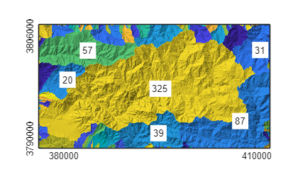
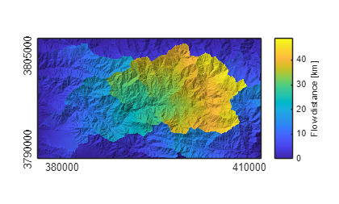
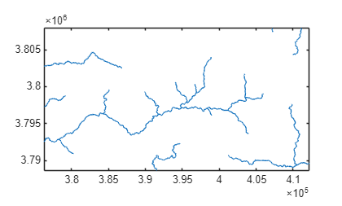
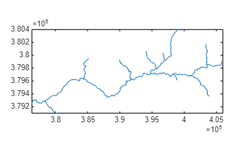
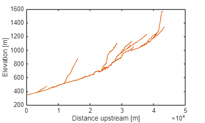

# User Guide to TopoToolbox \- Introduction


TopoToolbox provides a set of Matlab functions that support the analysis of relief and flow pathways in digital elevation models. The major aim of TopoToolbox is to offer helpful analytical GIS utilities in a non\-GIS environment in order to support the simultaneous application of GIS\-specific and other quantitative methods. 


TopoToolbox is written in the Matlab language and requires the Image Processing Toolbox. In addition, the Mapping Toolbox is recommended to have as it enables working with different cartographic projections and simplifies data exchange (reading of geotiffs, reading and writing of shapefiles).

# About the User Guide

This user guide is intended as a basic introduction to the TopoToolbox. It won't give a comprehensive overview on the functions available but serves a documentation for a simple session. In addition, this user guide provides an account for the command\-line based tools of TopoToolbox only. It does not expand upon the use of the GUIs.

# Load a DEM into Matlab

TopoToolbox 3 reads the ESRI ascii grid format and single band geotiffs into an instance of GRIDobj. 


**Note that, throughout the use of TopoToolbox, it is assumed that the DEM has a projected coordinate system (e.g. UTM WGS84) and that elevation and horizontal coordinates are in meter units.**

```matlab
DEM = GRIDobj('srtm_bigtujunga30m_utm11.tif');
```

DEM is now an instance of the class `GRIDobj`. DEM contains various properties that contain the gridded data and information on the spatial referencing of the grid.

```matlab
DEM
```

```matlabTextOutput
DEM = 
  GRIDobj with properties:

           Z: [643x1197 single]
    cellsize: 30
          wf: [2x3 double]
        size: [643 1197]
        name: ''
       zunit: ''
      xyunit: ''
      georef: [1x1 map.rasterref.MapCellsReference]

```


The data is stored in the property `.Z`. You can access it using linear indexing, subscripts or logical indexing as you are used to do with standard MATLAB matrices and arrays. E.g. the upper\-left 5x5 pixel in the grid can be accessed by following command.

```matlab
DEM.Z(1:5,1:5)
```

```matlabTextOutput
ans = 5x5 single matrix
   945   952   960   966   969
   944   951   956   959   957
   936   943   948   949   948
   929   935   939   941   940
   921   926   929   934   930

```


GRIDobj is associated with various methods. Some of these methods overwrite existing builtin functions (e.g. `plus`, `minus`, `isnan`).  Here is an overview of the methods (functions) that can be called with an instance of GRIDobj.

```matlab
methods GRIDobj
```

```matlabTextOutput
Methods for class GRIDobj:

GRIDobj                  GRIDobj2ascii            GRIDobj2geotable         GRIDobj2geotiff          GRIDobj2im               GRIDobj2mat              GRIDobj2pm               GRIDobj2polygon          GRIDobj2rgb              acv                      aggregate                all                      and                      any                      arcslope                 aspect                   castshadow               cellarea                 clip                     contour                  coord2ind                coord2sub                createmask               crop                     curvature                demarea                  demprofile               diffusion                dilate                   dist2curve               dist2line                distance                 elevateminima            eq                       erode                    evansslope               excesstopography         fillsinks                filter                   find                     findcoord                ge                       getcoordinates           getextent                getoutline               gradient8                graphflood               greedylabel              griddedcontour           gt                       hexgrid                  hillshade                histogram                hydrogram                hypscurve                identifyflats            imagesc                  imageschs                ind2coord                info                     inpaintnans              interp                   interp2GRIDobj           interpwithbarriers       isUnderlyingInteger      isUnderlyingNumeric      isUnderlyingType         isnan                    ksdensity                largestinscribedgrid     ldivide                  le                       line2GRIDobj             localtopography          log                      log10                    log2                     lt                       max                      measure                  min                      minmaxnorm               minus                    mosaic                   mpower                   mrdivide                 mtimes                   mustBeUnderlyingInteger  mustBeUnderlyingNumeric  mustBeUnderlyingType     ncols                    ne                       not                      nrows                    or                       pad                      plus                     polygon2GRIDobj          postprocflats            power                    prcclip                  project                  prominence               rand                     randomsample             rdivide                  reclabel                 reclassify               reproject2utm            resample                 roughness                shufflelabel             snap2stream              sqrt                     sub2coord                surf                     tanakacontour            times                    toposhielding            uminus                   underlyingType           uplus                    validatealignment        xor                      zscore                   
```

# View the DEM

Matlab provides numerous ways to display gridded data (images). Among these are `imagesc`, `surf`, `pcolor`, `imshow`, etc. TopoToolbox overwrites only `imagesc` and `surf`

```matlab
imagesc(DEM)
```


Note that the axes contain the x and y coordinates and that the axes are scaled equally.


Another useful function is imageschs which displays an instance of `GRIDobj` and overlays it with the DEM. Here we display the slope (see function `gradient8`) overlayn with the hillshade calculated from DEM. For visualization purposes the color range is restricted to slopes less than 1 m/m.

```matlab
G = gradient8(DEM);
imageschs(DEM,G,'ticklabel','nice',...
    'colorbarylabel','Slope [-]',...
    'clim',[0 1])
```


If none of the available visualization functions are what you are looking for, you can simply convert your DEM to the standard representation using GRIDobj2mat. The function returns two coordinate vectors and a matrix with values. Here we crop our DEM to a smaller extent before plotting.

```matlab
DEMc = crop(DEM,sub2ind(DEM.size,[1 50],[1 50]));
[Z,x,y] = GRIDobj2mat(DEMc);
surf(x,y,double(Z))
```


Note: See the help of the function `crop` on other ways to clip your data to a desired extent.

# Topographic attributes

Topographic attributes are derivatives obtained from a DEM such as slope, exposition or curvature. We assume that you are familiar with the meaning of these attributes and you will notice must of the functions by their function name such as

-  `gradient8` \-> as opposed to the Matlab builtin gradient function, `gradient8` calculates the gradient in 8 possible directions for each cell and takes the maximum. 
-  `curvature` \-> the second derivative of a DEM. 
-  `roughness` \-> allows you calculate various roughness indices related to intercell, topographic variability such as ruggedness etc. 
-  `aspect` \-> slope exposition 
-  and many more 
# Export an instance of GRIDobj to the disk

TopoToolbox ships with two functions for writing instances of GRIDobj back the hard drive so that they can be read by standard GIS software such as ArcGIS etc.


`GRIDobj2ascii(DEMc,'test.txt');`


`GRIDobj2geotiff(DEMc,'test.tif');`


Note that writing geotiffs is possible without having the mapping toolbox available. However, TopoToolbox will then write an image with a tfw\-file (worldfile) which will be used by other GIS software to georeference the grid. Yet, the grid won't have a projection which must then be defined in GIS. See help `GRIDobj2geotiff` for details.

# Fill sinks

Often DEMs feature erroneous topographic depressions that should be filled prior to flow path computation. You can fill sinks using the function `fillsinks`. Note that in some situations it is more appropriate to not fill sinks but to carve the DEM which will be shown below (see section on FLOWobj).

```matlab
DEMf = fillsinks(DEM);
```
# FLOWobj and flow related functions

TopoToolbox 3 uses a novel technique to store flow direction that allows for easy coding and fast performance. Flow direction is stored as a new object, `FLOWobj`, an instance of which is derived from an existing DEM (instance of `GRIDobj`).


Here is a fast way to calculate flow accumulation based on the unprocessed DEM. Morphological dilation of the flow accumulation grid acts as a maximum filter that enhances the visual appearance of the flow paths in the figure.

```matlab
FD = FLOWobj(DEM);
A  = flowacc(FD);
imageschs(DEM,dilate(sqrt(A),ones(5)),'colormap',flowcolor,...
    'colorbarylabel','Flow accumulation [sqrt(# of pixels)]',...
    'ticklabel','nice');
```


When creating an instance of `FLOWobj`, you can set numerous options that are summarized in the help of `FLOWobj`. 

# Methods associated with FLOWobj

Various methods exist that operate on instances of FLOWobj to obtain flow related variables such as drainage basin delineation, flow accumulation, etc. Here is an overview

```matlab
methods FLOWobj
```

```matlabTextOutput
Methods for class FLOWobj:

FLOWobj                  FLOWobj2GRIDobj          FLOWobj2M                FLOWobj2cell             clip                     coord2ind                crop                     dbasymmetry              dbentropy                dependencemap            drainagebasins           drainagebasinstats       find                     flipdir                  flowacc                  flowconvergence          flowdistance             flowdivergence           flowpathextract          flowtime                 flowvec                  getoutlets               gradient                 imposemin                ind2coord                influencemap             ismulti                  mapfromnal               meltonruggedness         multi2single             multi_normalize          plotdbfringe             propagatevaluesupstream  quantcarve               randomize                removesmallfractions     saveobj                  slopeareatool            streamorder              tfactor                  updatetoposort           upslopestats             validatealignment        vertdistance2stream      
```


Now, let's calculate the drainage basins of the DEM. This can be done using the function `drainagebasins`. You may want to shuffle the colors so that the drainage basins can be more easily distinguished in a plot (`shufflelabel`). As a small exercise, let's denote the area of each basin in the map. 

```matlab
DB = drainagebasins(FD);
DB = shufflelabel(DB);
```

Easy until here. Now let's get the area and display it together with the drainage basins map. To avoid overlapping labels, let's display only numbers for drainage basins larger than 10 km^2.

```matlab
nrDB = numel(unique(DB.Z(:)))-1; % nr of drainage basins
STATS = regionprops(DB.Z,'PixelIdxList','Area','Centroid');

imageschs(DEM,DB,'colorbar',false,'ticklabel','nice');

hold on
for run = 1:nrDB
    if STATS(run).Area*DB.cellsize^2 > 10e6
        [x,y] = ind2coord(DB,...
            sub2ind(DB.size,...
            round(STATS(run).Centroid(2)),...
            round(STATS(run).Centroid(1))));
        text(x,y,...
            num2str(round(STATS(run).Area * DB.cellsize^2/1e6)),...
            'BackgroundColor',[1 1 1]);
    end
end
hold off
```




It may also be interesting to know the distance from each drainage basin outlet in upstream direction along the flow network.

```matlab
D = flowdistance(FD);
D = D/1000;
imageschs(DEM,D,'ticklabel','nice','colorbarylabel','Flow distance [km]')
```



You can use the output of flowdistance to calculate the area function which is the frequency distribution of flow distances to the outlet of a specific basin. Let's take the largest basin in our study site.

```matlab
[~,IX] = max([STATS.Area]);
histogram(D.Z(DB.Z == IX),'Normalization','pdf');
xlabel('Distance to outlet [lm]');
ylabel('# cells');
```


# STREAMobj \- a class for stream networks

While FLOWobj stores the information on the entire flow network on hillslopes and in channels, STREAMobj is a class that is used to analyze the channelized part of the flow network only. The storage strategy is very similar to the one of the class FLOWobj.


Again, various methods (functions) are associated with STREAMobj that allow for manipulating, plotting and retrieving information on the stream network geometry and patterns.


There are various ways to extract the channelized flow network from DEMs. In this example we simply use an area threshold.

```matlab
% calculate flow accumulation
A = flowacc(FD);
% Note that flowacc returns the number of cells draining
% in a cell. Here we choose a minimum drainage area of 10000 cells.
W = A>10000;
% create an instance of STREAMobj
S = STREAMobj(FD,W);
% and plot it
plot(S);
axis image
```



STREAMobj stores various properties some of which you might use to directly access if you want to customize your code or build your own functions. Please check the help of STREAMobj.


Like the other TopoToolbox objects, STREAMobj are associated with numerous methods that enable modifying the geometry of the stream network, to extract trunk streams, to smooth, etc. An overview is again listed by the command

```matlab
methods STREAMobj
```

```matlabTextOutput
Methods for class STREAMobj:

STREAMobj            STREAMobj2GRIDobj    STREAMobj2SWATHobj   STREAMobj2XY         STREAMobj2cell       STREAMobj2geotable   STREAMobj2kml        STREAMobj2latlon     STREAMobj2mapstruct  aggregate            bifurcationratio     binarize             buffer               chiplot              chitransform         clean                conncomps            crs                  crslin               cummaxupstream       cumsum               cumtrapz             curvature            densify              diff                 distance             drainagedensity      extend2divide        extractconncomps     ezgetnal             fastscape            getlocation          getnal               getvalue             gradient             hillslopearea        identifyflats        imposemin            info                 inpaintnans          interp               intersect            intersectlocs        isempty              isequal              isnal                issubgraph           istrunk              klargestconncomps    knickpointfinder     ksn                  labelreach           loessksn             lowerenv             maplateral           mchi                 meanupstream         mincosthydrocon      mnoptim              mnoptimvar           modify               nal2nal              netdist              networksegment       orientation          plot                 plot3                plot3d               plotc                plotcategorical      plotdz               plotdzshaded         plotsegmentgeometry  plotstreamorder      quantcarve           randlocs             removeedgeeffects    removeshortstreams   rmedge               rmnode               sharedstreampower    sidebranching        sinuosity            slopearea            smooth               snap2stream          split                splitbyattribute     stackedplotdz        streamorder          streampoi            streamproj           subgraph             transformcoords      tribdir              truncate             trunk                union                validatealignment    widenstream          wmplot               zerobaselevel        
```


Now let's extract the largest subnetwork of the channel network 

```matlab
S = klargestconncomps(S,1);
plot(S); axis image
```



and plot flow distance along the stream network versus elevation.

```matlab
plotdz(S,DEM)
```



If you have a license of MATLAB's Mapping Toolbox you can export the stream network to a shapefile to be read by other GIS software. First, you need to create a geotable, a tabular data structure used by the Mapping Toolbox to store vector data. The function `shapewrite` to write the geotable to a shapefile.

```matlab
MS = STREAMobj2geotable(S);
```

`shapewrite(MS,'testshape.shp')`

# References

Schwanghart, W., Scherler, D. (2014): TopoToolbox 2 – MATLAB\-based software for topographic analysis and modeling in Earth surface sciences. Earth Surface Dynamics, 2, 1\-7. \[DOI: [10.5194/esurf\-2\-1\-2014](http://dx.doi.org/10.5194/esurf-2-1-2014)\]


Schwanghart, W., Kuhn, N.J. (2010): TopoToolbox: a set of Matlab functions for topographic analysis. Environmental Modelling & Software, 25, 770\-781. \[DOI: [10.1016/j.envsoft.2009.12.002](http://dx.doi.org/10.1016/j.envsoft.2009.12.002)\]

# History

This user guide was updated last: June 6, 2025.

