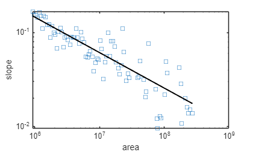
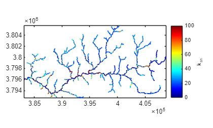

# User Guide to TopoToolbox \- Plotting ksn\-values


# Background

Stream profiles carry information on tectonic and/or climatic perturbations in the form of knickpoints migrating in upstream direction. Plotting ksn\-values provides a means to quantify deviations from the logarithmic channel length profile and thus enables to detect and visualize these locations in the stream network.


The basic assumption behind ksn\-values is that the stream power model of sediment transport/incision applies, e.g., sediment transport or incision are functions of the energy expenditure of water when moving downstream. In a landscape evolution context, the stream power model is written in following (simplified) form

 $$ \frac{dz}{dt}=U-kA^m {\left(\frac{dz}{dx}\right)}^n $$ 

where $U$ refers to the uplift rate, $A$ is the upslope area, $dz/dx$ is the slope and $k$, $m$ and $n$ are coefficients. In steady state the processes uplift and incision are in equilibrium such that $dz/dt=0$ at each point along the profile. Hence, the equation is rearranged

 $$ {\left(\frac{dz}{dx}\right)}^n =\frac{U}{kA^m } $$ 

 $$ \frac{dz}{dx}={\left(\frac{U}{k}\right)}^{1/n} A^{-n/m} $$ 

The terms are rewritten so that

 $$ S=k_{sn} A^{-\theta } $$ 

and

 $$ k_{sn} =\frac{S}{A^{-\theta } } $$ 

where $k_{sn}$ refers to the normalized channel steepness and $\theta$ to the channel concavity. $\theta$ ranges between 0.3 and 0.8 and often takes on the value 0.45. It can be determined either based on slope\-area plots (see function slopearea) or $\chi$ \-plots (see function chiplot).

# Load and generate required data
```matlab
DEM = GRIDobj('srtm_bigtujunga30m_utm11.tif');
FD  = FLOWobj(DEM,'preprocess','carve');
A   = flowacc(FD);
```

The quality of the DEM is relatively bad, so we correct it by imposing a downward minimum gradient.

```matlab
DEM = imposemin(FD,DEM,0.0001);
```

Subsequently, we extract a stream network by thresholding flow accumulation. In this example, we simply assume that channels occupy cells that have a minimum upslope area of 1000 pixels. We will only consider the largest stream network here, and extract it using the function klargestconncomps.

```matlab
S  = STREAMobj(FD,'minarea',1000);
S  = klargestconncomps(S,1);
```

We modify the stream network somewhat so that we avoid to include the alluvial areas in the most downstream portion of the profile. 

```matlab
S = modify(S,'distance',10000);
```

In order to remove small stream sections we again extract the largest connected component of the network

```matlab
S = klargestconncomps(S,1);
imageschs(DEM);
hold on
plot(S,'k')
hold off
```


```matlab
plotdz(S,DEM)
```


# Calculating the concavity index

After extracting the channel network of interest, we calculate the concavity index $\theta$ using the slopearea function. **Note that** slopearea returns the concavity index $\theta$ including its negative sign!

```matlab
STATS = slopearea(S,DEM,A)
```



```matlabTextOutput
STATS = struct with fields:
          a: [84x1 double]
          g: [84x1 double]
    hPoints: [1x1 Line]
         ks: 26.7408
      theta: -0.3772
      hLine: [1x1 Line]

```

# Calculate and plot ksn values

Subsequently, we calculate the ksn\-values for the entire grid. While this won't make sense for hillslope sections, our aim is to generate a grid that we can later reference with the stream network (STREAMobj).

```matlab
g   = gradient(S,DEM);
a   = getnal(S,A)*A.cellsize^2;
ksn = g./(a.^STATS.theta);

figure
plotc(S,ksn)
colormap(jet)
clim([0 100])
h   = colorbar;
h.Label.String = 'k_{sn}';
box on
axis image
```


# Aggregate ksn values in stream segments

Note that in the above figure each channel location in the grid is plotted. There are two problems arising from doing so. First, owing to the high point density in the xy plane some of the points and their color may not be visible due to overlapping. Second, owing to the poor quality of the DEM the ksn\-values are strongly variable at short distances. Note the large variability in the main river trunk! To avoid both problems, ksn values should be generalized along stream segments. This is achieved with the function STREAMobj/aggregate. Here we use a stream segment length of 1 km (1000 m).

```matlab
ksna = aggregate(S,ksn,'seglength',1000);
plotc(S,ksna)
clim([0 100])
h   = colorbar;
colormap(jet)
h.Label.String = 'k_{sn}';
box on
axis image
```


# Smoothing ksn values

Instead of aggregation, ksn\-values can also be smoothed using the function STREAMobj/smooth. This might allow to locate zones of high steepness more precisely.

```matlab
ksna = smooth(S,ksn,'K',20);
plotc(S,ksna)
clim([0 100])
h   = colorbar;
colormap(jet)
h.Label.String = 'k_{sn}';
box on
axis image
```


# Export as shapefile

Alternativly, you may want to choose another software to visualize the stream network together with ksn values. In order to do so, you will need the function shapewrite available with the mapping toolbox (in case you don't have access to the toolbox, check the Mathworks fileexchange for functions with same functionality). 

```matlab
MS = STREAMobj2mapstruct(S,'seglength',1000,'attributes',...
    {'ksn' ksn @mean ...
     'uparea' a @mean ...
     'gradient' g @mean});
```

`shapewrite(MS,'ksn_testshape.shp');`

# Reference

Schwanghart, W., Scherler, D. (2014): TopoToolbox 2 – MATLAB\-based software for topographic analysis and modeling in Earth surface sciences. Earth Surface Dynamics, 2, 1\-7. \[DOI: [10.5194/esurf\-2\-1\-2014](http://dx.doi.org/10.5194/esurf-2-1-2014)\]


Schwanghart, W., Kuhn, N.J. (2010): TopoToolbox: a set of Matlab functions for topographic analysis. Environmental Modelling & Software, 25, 770\-781. \[DOI: [10.1016/j.envsoft.2009.12.002](http://dx.doi.org/10.1016/j.envsoft.2009.12.002)\]

# History

This user guide was updated last: August 16, 2017.

