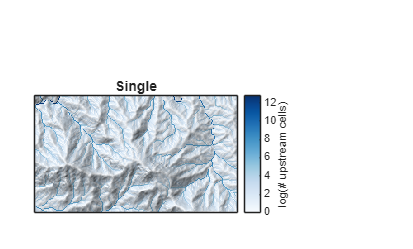
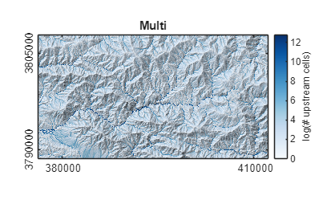
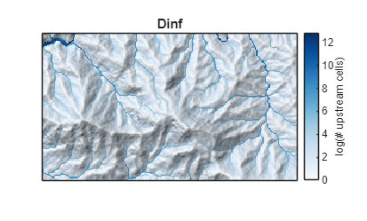

# User Guide to TopoToolbox \- multiple flow directions


# Background

There are different algorithms to model the flow of water and sediment across landscapes. Applications in tectonic geomorphology mostly use the D8 algorithm. This is a single flow direction (SFD) algorithm, i.e., flow from one pixel is allocated only to one downstream cell. Flows can only converge, but never diverge as they actually do on hillslopes, fans and alluvial plains. To model this behavior more realistically, multiple flow direction (MFD) algorithms exist that distribute water from one cell to several neighboring cells if these are lower or have equal height. 


TopoToolbox (Schwanghart and Scherler, 2014) implements the most common of these MFD algorithms: the multiple flow algorithm of Freeman (1991) and the Dinf algorithm of Tarboton (1997).

# The different flow algorithms in TopoToolbox

We will use the Big Tujunga data to illustrate the different behavior of these flow algorithms. Let's start with the single flow direction algorithm which is the default algorithm used by FLOWobj. 

```matlab
DEM = GRIDobj('srtm_bigtujunga30m_utm11.tif');
FD  = FLOWobj(DEM,'preprocess','carve');
A   = flowacc(FD);
imageschs(DEM,sqrt(A),'colorbarylabel','sqrt(# upstream cells)', ...
    'ticklabels','nice','colormap',flowcolor)
title('Single')
```


The advantage of the single flow direction is that it is computationally much more simple, requires less memory and is thus calculated quite quickly even for large DEMs. Moreover, TopoToolbox's implementation of the SFD algorithm requires no preprocessing of the DEM. Instead, FLOWobj handles sinks and flat areas in the DEM automatically. The drawback is that it may create some spurious, parallel flow patterns on hillslopes or in flat areas. 

```matlab
imageschs(DEM,log(A),'colorbarylabel','log(# upstream cells)', ...
    'ticklabels','nice','colormap',flowcolor)
setextent({[392624 400000] [3792674 3796916]},gca)
title('Single')
```



Now let's compare these flow patterns to those obtained from multiple flow directions. 

```matlab
FDm = FLOWobj(DEM,'multi');
A   = flowacc(FDm);
imageschs(DEM,log(A),'colorbarylabel','log(# upstream cells)', ...
    'ticklabels','nice','colormap',flowcolor)
setextent({[392624 400000] [3792674 3796916]},gca)
title('Multi')
```


Clearly, flow patterns on hillslopes appear smoother and may reflect better the true moisture pattern, though not necessarily runoff patterns. Zooming out, however, shows that runoff patterns on fans and low parts of the landscape appear much more realistic. 

```matlab
imageschs(DEM,log(A),'colorbarylabel','log(# upstream cells)', ...
    'ticklabels','nice','colormap',flowcolor)
title('Multi')
```



Finally, we compare the single and multi algorithms with Dinf.

```matlab
FDinf = FLOWobj(DEM,'dinf');
A   = flowacc(FDinf);
imageschs(DEM,log(A),'colorbarylabel','log(# upstream cells)', ...
    'ticklabels','nice','colormap',flowcolor)
setextent({[392624 400000] [3792674 3796916]},gca)
title('Dinf')
```



Flow patterns look less dispersive compared to the multi algorithm.

```matlab
imageschs(DEM,log(A),'colorbarylabel','log(# upstream cells)', ...
    'ticklabels','nice','colormap',flowcolor)
title('Dinf')
```


The advantage of the Dinf algorithm is that it probably reflects best the true flow patterns but this may depend on application, DEM resolution, and other factors. From a computational point of view, Dinf requires less memory because each cell drains to a maximum of two neighbors.

# Reference

Freeman, T.G. (1991): Calculating catchment area with divergent flow based on a regular grid. Computers & Geosciences 17, 413\-422. \[DOI:[10.1016/0098\-3004(91)90048\-I](https://doi.org/10.1016/0098-3004(91)90048-I)\]


Schwanghart, W., Scherler, D. (2014): TopoToolbox 2 – MATLAB\-based software for topographic analysis and modeling in Earth surface sciences. Earth Surface Dynamics, 2, 1\-7. \[DOI: [10.5194/esurf\-2\-1\-2014](http://dx.doi.org/10.5194/esurf-2-1-2014)\]


Tarboton, D.G. (1997). A new method for the determination of flow directions and upslope areas in grid digital elevation models. Water Resour. Res. 33, 309\-319. \[DOI:[10.1029/96WR03137](https://doi.org/10.1029/96WR03137)\]

# History

This user guide was updated last: June 10, 2025.

